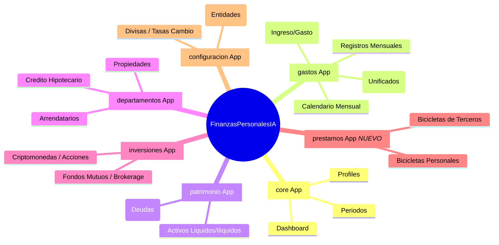

# 🤖 AI Agent Guide - FinanzasPersonalesIA

Proyecto de en desarrollo, el proyecto es para organizar las finanzas personales. Como esta en desarrollo los datos y la logica pueden cambiar. La idea es implementando caracteristicas poco a poco y los datos dentro de lo posible se mantengan relacionados si el ambito lo permite.

Proyecto hecho en Django.

Haz una bitacora de los cambios que hagas en el proyecto en el archivo AGENTS.md, ademas de los cambios que hagas en el codigo.

Genera un mapa mental del proyecto tambien en AGENTS.md, asi como sus cambios.

Y nunca olvidar actualizar README.md si aplica.

---

## 📝 Bitácora de Cambios (Changelog)

### [2026-03] Soporte de Modales de Arrendatario y Crédito
- **Nuevas Funcionalidades**:
  - Implementación de modales interactivos en la interfaz para la creación, edición y eliminación de Arrendatarios y Créditos Hipotecarios dentro de `departamentos.html`.
- **Vistas y URLs**:
  - Creación de rutas CRUD y vistas asociadas (`crear_arrendatario`, `editar_arrendatario`, `crear_credito`, etc.) en `core/views.py` e inyección de la colección de entidades Bancarias al contexto.

### [2026-03] Soporte de Fechas en Portafolio Inmobiliario
- **Vistas y Templates**:
  - Se actualizaron las vistas `crear_departamento` y `editar_departamento` en `core/views.py` para procesar los campos `fecha_inicio`, `fecha_ultima_cuota` y `plazo_anos`.
  - Se añadieron inputs al modal de creación y edición en `departamentos.html` para permitir registrar las fechas y plazos de los créditos, habilitando el cálculo automático del progreso de pago de la propiedad.

### [2026-03] Corrección de Contexto en Carga Masiva (Hotfix)
- **Vistas**:
  - Se actualizó el contexto en la vista `gastos_table` en `core/views.py` para incluir `grouped_categorias`, `default_year` y `default_month`. Esto soluciona un bug donde el modal de Carga Masiva no mostraba ningún input (campos de categoría) al ser renderizado directamente dentro de la página de gastos.

### [2026-03] Carga de Datos Reales (Migración)
- **Automatización**:
  - Creación del script `load_real_data.py` para automatizar la inserción de datos históricos y actuales extraídos de capturas de pantalla de control financiero.
- **Datos Cargados**:
  - **Historial de Patrimonio**: Importación de snapshots mensuales (2025-2026) con balances de activos, pasivos y patrimonio neto (CLP/USD).
  - **Activos y Pasivos**: Registro de tenencias actuales en activos líquidos (efectivo, inversiones en Crypto/Fintual/DVA) e ilíquidos (departamentos, ahorros AFP) y pasivos (deuda Scotiabank, tarjetas de crédito).
  - **Registros Mensuales**: Poblado de ingresos (Salario, Arriendos) y gastos (TDC, Suscripciones como Netflix/Youtube) para tests de dashboard con datos realistas.

### [2026-03] Compatibilidad con bases de datos en blanco (Hotfix)
- **Vistas**: 
  - Corrección de errores 500 (`TipoCambio.DoesNotExist`, `UnboundLocalError` y `RelatedObjectDoesNotExist` en Arrendatarios) en vistas como Dashboard y Departamentos que impedían la carga en base de datos vacías o con datos parciales. Se agregaron bloques `try/except` y validaciones con `hasattr` en `core/views.py`.
- **Templates**:
  - Se mejoró la estabilidad de `departamentos.html` para manejar propiedades sin arrendatarios asignados, evitando errores de renderizado y mostrando el estado "Disponible".
- **Integraciones (Mindicador API)**:
  - Se añadió `verify=False` a la solicitud en `configuracion/utils.py` para saltar el chequeo estricto (`CERTIFICATE_VERIFY_FAILED`) que ocurre en macOS y Python 3.13 con el certificado de Mindicador.cl.

### [2026-03] Snapshot Patrimonial Manual (Desarrollo)
- **Nueva Funcionalidad**:
  - Se agregó una vista `take_snapshot` en `configuracion/views.py` que calcula todos los activos, inversiones, propiedades y pasivos, mapeando los valores actuales de UF y Dólar para insertarlos en `HistorialInversion` y `SnapshotPatrimonio`.
  - Añadido un botón "Guardar Snapshot Actual" en la página de Configuración bajo la nueva sección "Snapshot de Patrimonio (Manual)", permitiendo sacar la "foto" contable al instante sin depender de Celery / Tareas asíncronas en entorno de desarrollo.

### [2026-03] Compatibilidad con Python 3.13 y macOS (Hotfix)
- **Dependencias Actualizadas**:
  - `psycopg2-binary` actualizado a `2.9.10` para incluir soporte nativo (wheels) para Python 3.13 en macOS ARM64.
  - `Pillow` actualizado a `11.1.0` para corregir error de instalación (`KeyError: '__version__'`) en Python 3.13.
  - `reportlab` actualizado a `4.2.5` para garantizar compatibilidad con el nuevo entorno.
  - `django-filter` ajustado a `24.3` para resolver conflicto de versiones con `Django 5.1.7`.
- **Entorno de Desarrollo**:
  - Actualización de `pip` en el entorno virtual para mejorar la resolución de dependencias.

### [2026-03] Optimización de Calendario y CRUD de Propiedades
- **Modelos Actualizados**:
  - Simplificación y unificación de previsiones periódicas: Se borraron `GastoMensual`, `GastoTrimestral` y `GastoAnual` consolidándolos en un solo modelo **`GastoProgramado`** con campo dinámico de `frecuencia` y `fecha_inicio`.
- **Vistas y Templates**:
  - Actualización de `gastos/admin.py`, `gastos/views.py`, `gastos/serializers.py` y `core/views.py` para usar `GastoProgramado` y sus respectivos lógicos de cálculos y ahorro.
  - El diseño del calendario `calendario.html` ahora emplea una sola tabla de "Gastos Programados" y un solo modal dinámico de creación en lugar de tres.
  - Implementado CRUD nativo en frontend (modales y tablas) para **Departamentos** (Portafolio Inmobiliario) en `departamentos.html`, eliminando la dependencia a la interfaz de Django Admin.
- **Flujo de Datos y Fixtures**:
  - Actualizados los scripts de volcado de datos inciales (`populate_fixtures.py`) para generar `GastoProgramado` con las frecuencias correspondientes en vez de usar los modelos legacy borrados.

### [2026-03] Actualización Masiva (Bicicletas, Categorías, y Departamentos)
- **Modelos Actualizados**: 
  - `CategoriaIngreso` incluye `contabilizar` y `moneda_defecto`.
  - `Departamento` ahora rastrea `fecha_inicio`, `fecha_ultima_cuota`, y `plazo_anos` con la propiedad automática `progreso_pago`.
  - `Banco` incluye `notas` y `mostrar_en_carga_masiva`.
  - `RegistroMensual` agregó `monto_contable_clp`.
- **Nuevo Módulo**: Creada app `prestamos` para gestionar "Bicicletas" (Préstamos Personales y a Terceros).
- **Vistas y Dashboard**:
  - Incorporada deducción automática de préstamos activos a terceros desde los gastos de tarjetas de crédito en el Dashboard.
  - CRUD completo integrado para Bancos y Categorías en Configuración.
  - Orden personalizado de carga masiva (Ingresos primero) con enlaces de ancla (anchor links).
  - Vistas de gastos mensuales ahora operan por defecto con el mes inmediatamente anterior.
- **Templates Mejorados**: Modificados `gastos_table.html`, `bulk_gastos_modal.html`, `departamentos.html` y creación de `prestamos/index.html`.

### [2026-03] Calendario y Ajustes UI/UX
- **UI/UX**: Se ocultaron los controles (spinners) por defecto de los campos de número para una interfaz más limpia.
- **Modelos Actualizados**:
  - `CategoriaIngreso` agregó `dia_cobro` para programar cobros y pagos a lo largo del mes.
- **Vistas y Dashboard**:
  - CRUD de Entidades Financieras ahora soporta operaciones sobre `Producto` bancario (Tarjetas, Créditos, etc.)
  - Desglose transaccional mejorado con espacios vacíos (`h-4`) entre distintas categorías base para mayor legibilidad.
- **Nuevo Módulo "Calendario & Previsión"**:
  - Nueva página `/calendario/` para observar el calendario mensual de pagos con `CategoriaIngreso` y `Departamento`.
  - CRUD completo para `GastoAnual` y `GastoTrimestral`, incorporando cálculo en interfaz del ahorro mensual necesario.

---

## 🧠 Mapa Mental del Proyecto (Actualizado)

