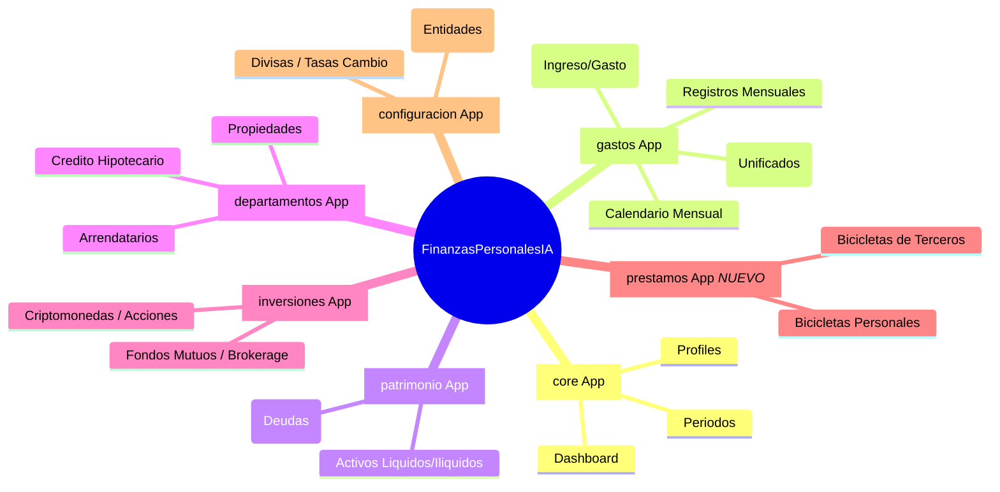

# 🤖 AI Agent Guide - FinanzasPersonalesIA

Proyecto de en desarrollo, el proyecto es para organizar las finanzas personales. Como esta en desarrollo los datos y la logica pueden cambiar. La idea es implementando caracteristicas poco a poco y los datos dentro de lo posible se mantengan relacionados si el ambito lo permite.

Proyecto hecho en Django.

Haz una bitacora de los cambios que hagas en el proyecto en el archivo AGENTS.md, ademas de los cambios que hagas en el codigo.

Genera un mapa mental del proyecto tambien en AGENTS.md, asi como sus cambios.

Y nunca olvidar actualizar README.md si aplica.

---

## 📝 Bitácora de Cambios (Changelog)

### [2026-03] Optimización de Calendario y CRUD de Propiedades
- **Modelos Actualizados**:
  - Simplificación y unificación de previsiones periódicas: Se borraron `GastoMensual`, `GastoTrimestral` y `GastoAnual` consolidándolos en un solo modelo **`GastoProgramado`** con campo dinámico de `frecuencia` y `fecha_inicio`.
- **Vistas y Templates**:
  - Actualización de `gastos/admin.py`, `gastos/views.py`, `gastos/serializers.py` y `core/views.py` para usar `GastoProgramado` y sus respectivos lógicos de cálculos y ahorro.
  - El diseño del calendario `calendario.html` ahora emplea una sola tabla de "Gastos Programados" y un solo modal dinámico de creación en lugar de tres.
  - Implementado CRUD nativo en frontend (modales y tablas) para **Departamentos** (Portafolio Inmobiliario) en `departamentos.html`, eliminando la dependencia a la interfaz de Django Admin.
- **Flujo de Datos y Fixtures**:
  - Actualizados los scripts de volcado de datos inciales (`populate_fixtures.py`) para generar `GastoProgramado` con las frecuencias correspondientes en vez de usar los modelos legacy borrados.

### [2026-03] Actualización Masiva (Bicicletas, Categorías, y Departamentos)
- **Modelos Actualizados**: 
  - `CategoriaIngreso` incluye `contabilizar` y `moneda_defecto`.
  - `Departamento` ahora rastrea `fecha_inicio`, `fecha_ultima_cuota`, y `plazo_anos` con la propiedad automática `progreso_pago`.
  - `Banco` incluye `notas` y `mostrar_en_carga_masiva`.
  - `RegistroMensual` agregó `monto_contable_clp`.
- **Nuevo Módulo**: Creada app `prestamos` para gestionar "Bicicletas" (Préstamos Personales y a Terceros).
- **Vistas y Dashboard**:
  - Incorporada deducción automática de préstamos activos a terceros desde los gastos de tarjetas de crédito en el Dashboard.
  - CRUD completo integrado para Bancos y Categorías en Configuración.
  - Orden personalizado de carga masiva (Ingresos primero) con enlaces de ancla (anchor links).
  - Vistas de gastos mensuales ahora operan por defecto con el mes inmediatamente anterior.
- **Templates Mejorados**: Modificados `gastos_table.html`, `bulk_gastos_modal.html`, `departamentos.html` y creación de `prestamos/index.html`.

### [2026-03] Calendario y Ajustes UI/UX
- **UI/UX**: Se ocultaron los controles (spinners) por defecto de los campos de número para una interfaz más limpia.
- **Modelos Actualizados**:
  - `CategoriaIngreso` agregó `dia_cobro` para programar cobros y pagos a lo largo del mes.
- **Vistas y Dashboard**:
  - CRUD de Entidades Financieras ahora soporta operaciones sobre `Producto` bancario (Tarjetas, Créditos, etc.)
  - Desglose transaccional mejorado con espacios vacíos (`h-4`) entre distintas categorías base para mayor legibilidad.
- **Nuevo Módulo "Calendario & Previsión"**:
  - Nueva página `/calendario/` para observar el calendario mensual de pagos con `CategoriaIngreso` y `Departamento`.
  - CRUD completo para `GastoAnual` y `GastoTrimestral`, incorporando cálculo en interfaz del ahorro mensual necesario.

---

## 🧠 Mapa Mental del Proyecto (Actualizado)

