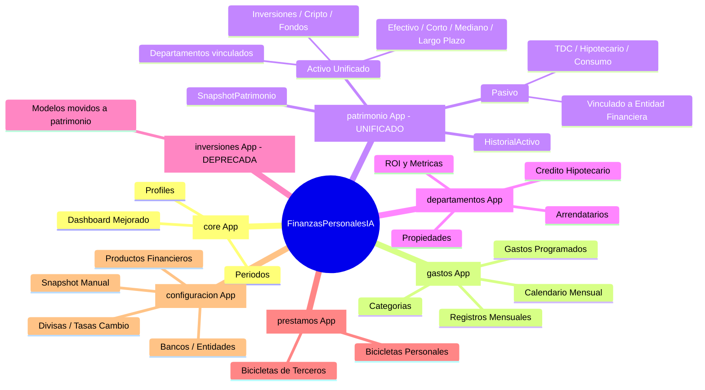

# 🤖 AI Agent Guide - FinanzasPersonalesIA

Proyecto de en desarrollo, el proyecto es para organizar las finanzas personales. Como esta en desarrollo los datos y la logica pueden cambiar. La idea es implementando caracteristicas poco a poco y los datos dentro de lo posible se mantengan relacionados si el ambito lo permite.

Proyecto hecho en Django.

Haz una bitacora de los cambios que hagas en el proyecto en el archivo AGENTS.md, ademas de los cambios que hagas en el codigo.

Genera un mapa mental del proyecto tambien en AGENTS.md, asi como sus cambios.

Y nunca olvidar actualizar README.md si aplica.

---

## 📝 Bitácora de Cambios (Changelog)
+
+### [2026-03] Cardstats en Calendario & Ahorro Programado
+- **Métricas de Ahorro**: Implementación de un panel de Cardstats en `/dashboard/calendario/` para visualizar el esfuerzo de ahorro mensual necesario.
+- **Cálculo de Reserva**: Los Gastos Programados con frecuencia no mensual (Anual, Semestral, etc.) ahora muestran su cuota de ahorro mensual equivalente en un Card-stat unificado (`ahorro_mensual_total`).
+- **Quick Insights**:
+  - Se añadió un contador de Gastos Activos.
+  - Se implementó un detector de "Próximo Vencimiento" que prioriza el pago más cercano en el calendario del mes actual.
+- **Archivos actualizados**: `core/views.py`, `templates/calendario.html`.
+

### [2026-03] Sincronización Mensual de Bicicletas (Fix & UX)
- **Compensación de Gastos Real**: Se eliminó la deducción estática global de préstamos de terceros en el Dashboard. Ahora, al crear o editar una "Bicicleta" de terceros, se genera automáticamente un `RegistroMensual` (tipo GASTO, monto negativo) para compensar el gasto de la tarjeta de crédito.
- **Corrección de Bug**: Se arregló un `TypeError` que ocurría al intentar editar una bicicleta debido a tipos de datos incompatibles (Decimal vs String).
- **Control de Periodos**: El modal de préstamos ahora incluye una sección para elegir el mes de registro (Mes Anterior o Mes Actual), asegurando que el descuento solo aplique al mes correspondiente.
- **Refactor de Vistas**: Limpieza y optimización de la lógica en `core/views.py` y `prestamos/views.py` para manejar periodos dinámicos.
- **Archivos actualizados**: `core/views.py`, `prestamos/views.py`, `prestamos/templates/prestamos/index.html`.

### [2026-03] Sincronización y Métricas de Departamentos
- **Categorías de Ingreso Automáticas**: 
  - Se implementó `ensure_departamento_categories` para sincronizar retroactivamente las categorías de arriendo para todos los departamentos existentes.
  - La sincronización ocurre automáticamente al visitar la página de Departamentos.
  - Se añadió lógica en `editar_departamento` para renombrar la categoría de ingreso asociada si el código del departamento cambia, manteniendo la integridad del historial de registros.
- **Métricas de Recaudación**:
  - Nueva columna en la tabla de Performance & Yield: "% Recaudado" (Ingreso Real vs Renta Pactada).
  - Visualización mejorada con barras de progreso y colores dinámicos según el cumplimiento del pago.
  - Uso de `deptos_con_roi` en el template para mostrar Cap Rate y ROI Total calculados en el backend.

### [2026-03] Sincronización de Tarjetas de Crédito (TDC) en Pasivos
- **Entidades Financieras → Pasivos**:
  - Se habilitó la auto-creación de `Pasivo` para productos tipo `TDC` (Tarjeta de Crédito), igualando el comportamiento de Créditos de Consumo e Hipotecarios.
  - Se implementó un helper `ensure_pasivos_for_products` que sincroniza retroactivamente cualquier `Producto` de deuda (TDC, Consumo, Hipotecario) con su respectivo `Pasivo` si este no existe.
  - La sincronización ocurre automáticamente al visitar la página de Pasivos (`/dashboard/pasivos/`) y al crear o editar productos en Entidades Financieras.
- **Archivos actualizados**: `core/views.py`.

### [2026-03] Corrección de Layout en Departamentos (Hotfix)
- **Templates**:
  - Se corrigió un error en `templates/departamentos.html` donde etiquetas `
` mal cerradas o extra rompían el grid del portafolio inmobiliario cuando una propiedad tenía una hipoteca asociada.
  - Se eliminaron 3 etiquetas `
` huérfanas que causaban comportamientos inesperados en el scroll y la alineación de las tarjetas.
- **Archivos actualizados**: `templates/departamentos.html`.

### [2026-03] Integraciones Automáticas: Bicicletas, Hipotecas & Pasivos (Enhancement)
- **Bicicletas de Terceros → Categoría de Ingreso + Activo**:
  - Al crear un préstamo tipo `TERCEROS`, se auto-genera una `CategoriaIngreso` tipo INGRESO `"Cobro Bicicleta - {nombre}"` con `mostrar_en_carga_masiva=True` para poder registrar cobros en carga masiva.
  - Simultáneamente se auto-genera un `Activo` tipo `PRESTAMO_DADO`, no líquido, horizonte corto plazo, con el mismo monto del préstamo.
  - Al editar el préstamo, se sincronizan nombre y monto en la categoría y el activo.
  - Al eliminar el préstamo, se eliminan la categoría y el activo vinculados.
- **Productos CREDITO_HIPOTECARIO / CREDITO_CONSUMO → Auto-Pasivo**:
  - Al crear un `Producto` de tipo `CREDITO_HIPOTECARIO` o `CREDITO_CONSUMO` en Entidades Financieras, se auto-genera un `Pasivo` vinculado con monto inicial $0 (para que el usuario lo actualice).
  - Los pasivos auto-generados están protegidos contra eliminación (candado 🔒).
- **Departamentos — Vincular Hipotecas existentes**:
  - `CreditoHipotecario` ahora tiene FK a `Producto` (opcional), permitiendo seleccionar un crédito hipotecario existente desde Entidades Financieras.
  - El modal de hipoteca en Departamentos cambió de "seleccionar Banco" a "Seleccionar Crédito Hipotecario (Entidad Financiera)". El banco se deriva automáticamente del producto.
  - Propiedad `banco_display` en el modelo para obtener banco de producto o FK directa.
- **Archivos actualizados**: `departamentos/models.py`, `prestamos/views.py`, `core/views.py`, `templates/departamentos.html`.

### [2026-03] Rework Patrimonio, Inversiones & Dashboard (Major)
- **Modelos**:
  - Modelo `Activo` unificado: fusión de `inversiones.Inversion` + `patrimonio.Activo` en un solo modelo con campos `horizonte_temporal` (EFECTIVO / CORTO_PLAZO / MEDIANO_PLAZO / LARGO_PLAZO), `es_liquido` (boolean), y `activo` (flag).
  - `HistorialInversion` → `HistorialActivo` movido a `patrimonio/models.py` con FK al `Activo` unificado.
  - `Pasivo` añade campo `activo` (boolean), `producto` (FK a Producto para vincular con Entidades Financieras), y tipo `CREDITO_CONSUMO`.
  - Eliminados modelos `Inversion` y `HistorialInversion` de la app `inversiones` (app vaciada, conservada por historial de migraciones).
- **Nueva Página — Activos** (`/dashboard/activos/`):
  - Reemplaza la anterior "Inversiones" con tabla agrupada por horizonte temporal.
  - Departamentos aparecen como activos inmobiliarios vinculados en el grupo "Largo Plazo".
  - CRUD completo con modales funcionales (crear, editar, eliminar).
  - Gráficas: Asset Allocation (doughnut), Ratio de Liquidez (doughnut), y Evolución del Portafolio (line chart desde HistorialActivo).
- **Nueva Página — Pasivos** (`/dashboard/pasivos/`):
  - CRUD dedicado para gestión de deudas.
  - Items vinculados a Entidades Financieras protegidos contra eliminación (icono candado 🔒).
  - Agrupados por tipo: TDC, Crédito Hipotecario, Crédito de Consumo, Préstamo, Otro.
  - Métricas: Total Pasivos, Nº Deudas, Ratio D/A.
- **Dashboard Mejorado**:
  - Nuevas gráficas: Pie de Liquidez (Líquido vs No Líquido), Evolución Patrimonial (3 líneas: Activos/Pasivos/Neto desde SnapshotPatrimonio), Tendencia Ingresos & Gastos (últimos 6 meses con toggle).
  - Selector de mes para Flujo de Caja (dropdown con meses disponibles).
  - Top Activos y Propiedades como quick-links.
- **Patrimonio** (`/dashboard/patrimonio/`):
  - Simplificado a página resumen/hub con links directos a Activos y Pasivos.
  - Tabla de historial de Snapshots.
- **Sidebar**:
  - "Inversiones" renombrado a "Activos".
  - Nuevo link "Pasivos" con icono `fa-credit-card`.
- **Departamentos — Auto-INGRESO**:
  - Al crear un departamento, se auto-genera una `CategoriaIngreso` tipo INGRESO `"Arriendo {codigo}"` con `mostrar_en_carga_masiva=True`.
  - Al borrar un departamento, se elimina la categoría asociada.
  - Cálculo de métricas ROI (Cash Flow, Amortización, Total, % Administración) en la vista de departamentos.
- **Archivos actualizados**: `patrimonio/models.py`, `patrimonio/admin.py`, `inversiones/models.py`, `inversiones/admin.py`, `core/views.py`, `core/urls.py`, `configuracion/views.py`, `templates/base.html`, `templates/dashboard.html`, `templates/activos.html` (nuevo), `templates/pasivos.html` (nuevo), `templates/patrimonio.html`, `load_real_data.py`, `populate_fixtures.py`.

### [2026-03] Edición de Gastos Programados (Enhancement)

### [2026-03] Tipos de Categoría y Carga Masiva (Fix/Enhancement)
- **Modelos Actualizados**:
  - `CategoriaIngreso` y `RegistroMensual` ahora soportan nuevos tipos: `INVERSION` (Inversión), `CREDITO_CONSUMO` (Crédito de Consumo) y `CREDITO_HIPOTECARIO` (Crédito Hipotecario).
  - Se añadió `mostrar_en_carga_masiva` a `CategoriaIngreso` y la llave foránea `producto_asociado` para enlazar Productos financieros a Categorías (Módulo de Configuración).
  - El modelo `Producto` ahora incluye `tiene_cupo_usd` para administrar tarjetas bimoneda de forma segregada.
- **Vistas y Templates**:
  - Actualización de las consultas en `gastos_table` y `bulk_gastos` (en `core/views.py`) para filtrar categorías basándose en su propio campo de persistencia.
  - Implementada Sincronización Automática: al crear un `Producto` (como TDC, Créditos, etc.), se auto-genera su `CategoriaIngreso` asociada. Si el producto tiene cupo USD, se generan dos categorías individuales ("TDC (CLP)" y "TDC (USD)").
  - Bloqueo de borrado y ocultamiento del botón de edición en "Categorías" para aquellas autogeneradas (aparecen candados) previniendo desincronización y problemas de integridad relacional. Se eliminan desde Entidades Financieras.
  - Consolidación semántica de Tipos: Se movieron los "tipos" `TDC`, `COBRO_BANCO`, `CREDITO_CONSUMO` y `CREDITO_HIPOTECARIO` desde el formulario manual de Categorías hacia el formulario de Productos, forzando a que éstos se creen únicamente desde Entidades y manteniendo coherencia total.

### [2026-03] Soporte de Modales de Arrendatario y Crédito
- **Nuevas Funcionalidades**:
  - Implementación de modales interactivos en la interfaz para la creación, edición y eliminación de Arrendatarios y Créditos Hipotecarios dentro de `departamentos.html`.
- **Vistas y URLs**:
  - Creación de rutas CRUD y vistas asociadas (`crear_arrendatario`, `editar_arrendatario`, `crear_credito`, etc.) en `core/views.py` e inyección de la colección de entidades Bancarias al contexto.

### [2026-03] Soporte de Fechas en Portafolio Inmobiliario
- **Vistas y Templates**:
  - Se actualizaron las vistas `crear_departamento` y `editar_departamento` en `core/views.py` para procesar los campos `fecha_inicio`, `fecha_ultima_cuota` y `plazo_anos`.
  - Se añadieron inputs al modal de creación y edición en `departamentos.html` para permitir registrar las fechas y plazos de los créditos, habilitando el cálculo automático del progreso de pago de la propiedad.

### [2026-03] Corrección de Contexto en Carga Masiva (Hotfix)
- **Vistas**:
  - Se actualizó el contexto en la vista `gastos_table` en `core/views.py` para incluir `grouped_categorias`, `default_year` y `default_month`. Esto soluciona un bug donde el modal de Carga Masiva no mostraba ningún input (campos de categoría) al ser renderizado directamente dentro de la página de gastos.

### [2026-03] Carga de Datos Reales (Migración)
- **Automatización**:
  - Creación del script `load_real_data.py` para automatizar la inserción de datos históricos y actuales extraídos de capturas de pantalla de control financiero.
- **Datos Cargados**:
  - **Historial de Patrimonio**: Importación de snapshots mensuales (2025-2026) con balances de activos, pasivos y patrimonio neto (CLP/USD).
  - **Activos y Pasivos**: Registro de tenencias actuales en activos líquidos (efectivo, inversiones en Crypto/Fintual/DVA) e ilíquidos (departamentos, ahorros AFP) y pasivos (deuda Scotiabank, tarjetas de crédito).
  - **Registros Mensuales**: Poblado de ingresos (Salario, Arriendos) y gastos (TDC, Suscripciones como Netflix/Youtube) para tests de dashboard con datos realistas.

### [2026-03] Compatibilidad con bases de datos en blanco (Hotfix)
- **Vistas**: 
  - Corrección de errores 500 (`TipoCambio.DoesNotExist`, `UnboundLocalError` y `RelatedObjectDoesNotExist` en Arrendatarios) en vistas como Dashboard y Departamentos que impedían la carga en base de datos vacías o con datos parciales. Se agregaron bloques `try/except` y validaciones con `hasattr` en `core/views.py`.
- **Templates**:
  - Se mejoró la estabilidad de `departamentos.html` para manejar propiedades sin arrendatarios asignados, evitando errores de renderizado y mostrando el estado "Disponible".
- **Integraciones (Mindicador API)**:
  - Se añadió `verify=False` a la solicitud en `configuracion/utils.py` para saltar el chequeo estricto (`CERTIFICATE_VERIFY_FAILED`) que ocurre en macOS y Python 3.13 con el certificado de Mindicador.cl.

### [2026-03] Snapshot Patrimonial Manual (Desarrollo)
- **Nueva Funcionalidad**:
  - Se agregó una vista `take_snapshot` en `configuracion/views.py` que calcula todos los activos, inversiones, propiedades y pasivos, mapeando los valores actuales de UF y Dólar para insertarlos en `HistorialInversion` y `SnapshotPatrimonio`.
  - Añadido un botón "Guardar Snapshot Actual" en la página de Configuración bajo la nueva sección "Snapshot de Patrimonio (Manual)", permitiendo sacar la "foto" contable al instante sin depender de Celery / Tareas asíncronas en entorno de desarrollo.

### [2026-03] Compatibilidad con Python 3.13 y macOS (Hotfix)
- **Dependencias Actualizadas**:
  - `psycopg2-binary` actualizado a `2.9.10` para incluir soporte nativo (wheels) para Python 3.13 en macOS ARM64.
  - `Pillow` actualizado a `11.1.0` para corregir error de instalación (`KeyError: '__version__'`) en Python 3.13.
  - `reportlab` actualizado a `4.2.5` para garantizar compatibilidad con el nuevo entorno.
  - `django-filter` ajustado a `24.3` para resolver conflicto de versiones con `Django 5.1.7`.
- **Entorno de Desarrollo**:
  - Actualización de `pip` en el entorno virtual para mejorar la resolución de dependencias.

### [2026-03] Optimización de Calendario y CRUD de Propiedades
- **Modelos Actualizados**:
  - Simplificación y unificación de previsiones periódicas: Se borraron `GastoMensual`, `GastoTrimestral` y `GastoAnual` consolidándolos en un solo modelo **`GastoProgramado`** con campo dinámico de `frecuencia` y `fecha_inicio`.
- **Vistas y Templates**:
  - Actualización de `gastos/admin.py`, `gastos/views.py`, `gastos/serializers.py` y `core/views.py` para usar `GastoProgramado` y sus respectivos lógicos de cálculos y ahorro.
  - El diseño del calendario `calendario.html` ahora emplea una sola tabla de "Gastos Programados" y un solo modal dinámico de creación en lugar de tres.
  - Implementado CRUD nativo en frontend (modales y tablas) para **Departamentos** (Portafolio Inmobiliario) en `departamentos.html`, eliminando la dependencia a la interfaz de Django Admin.
- **Flujo de Datos y Fixtures**:
  - Actualizados los scripts de volcado de datos inciales (`populate_fixtures.py`) para generar `GastoProgramado` con las frecuencias correspondientes en vez de usar los modelos legacy borrados.

### [2026-03] Actualización Masiva (Bicicletas, Categorías, y Departamentos)
- **Modelos Actualizados**: 
  - `CategoriaIngreso` incluye `contabilizar` y `moneda_defecto`.
  - `Departamento` ahora rastrea `fecha_inicio`, `fecha_ultima_cuota`, y `plazo_anos` con la propiedad automática `progreso_pago`.
  - `Banco` incluye `notas` y `mostrar_en_carga_masiva`.
  - `RegistroMensual` agregó `monto_contable_clp`.
- **Nuevo Módulo**: Creada app `prestamos` para gestionar "Bicicletas" (Préstamos Personales y a Terceros).
- **Vistas y Dashboard**:
  - Incorporada deducción automática de préstamos activos a terceros desde los gastos de tarjetas de crédito en el Dashboard.
  - CRUD completo integrado para Bancos y Categorías en Configuración.
  - Orden personalizado de carga masiva (Ingresos primero) con enlaces de ancla (anchor links).
  - Vistas de gastos mensuales ahora operan por defecto con el mes inmediatamente anterior.
- **Templates Mejorados**: Modificados `gastos_table.html`, `bulk_gastos_modal.html`, `departamentos.html` y creación de `prestamos/index.html`.

### [2026-03] Calendario y Ajustes UI/UX
- **UI/UX**: Se ocultaron los controles (spinners) por defecto de los campos de número para una interfaz más limpia.
- **Modelos Actualizados**:
  - `CategoriaIngreso` agregó `dia_cobro` para programar cobros y pagos a lo largo del mes.
- **Vistas y Dashboard**:
  - CRUD de Entidades Financieras ahora soporta operaciones sobre `Producto` bancario (Tarjetas, Créditos, etc.)
  - Desglose transaccional mejorado con espacios vacíos (`h-4`) entre distintas categorías base para mayor legibilidad.
- **Nuevo Módulo "Calendario & Previsión"**:
  - Nueva página `/calendario/` para observar el calendario mensual de pagos con `CategoriaIngreso` y `Departamento`.
  - CRUD completo para `GastoAnual` y `GastoTrimestral`, incorporando cálculo en interfaz del ahorro mensual necesario.

---

## 🧠 Mapa Mental del Proyecto (Actualizado)

